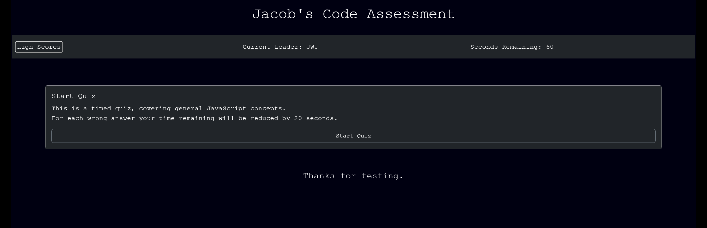

# Jacob's Code Assessment

## Description

This is a web app designed to present the user with a short JS code assessment quiz, monitored by a count down timer.

## Installation

This is a publicly hosted page, no installation is required.

## Usage

https://jacob-jeffries.github.io/m4c/

The site is simple to use, follow the onscreen prompts.

## Credits 

I utilized bootstrap in my code:
https://getbootstrap.com/

I utilized normalize.css in my code:
https://necolas.github.io/normalize.css/

## License

MIT License

Copyright (c) [2022] [Jacob Jeffries]

Permission is hereby granted, free of charge, to any person obtaining a copy
of this software and associated documentation files (the "Software"), to deal
in the Software without restriction, including without limitation the rights
to use, copy, modify, merge, publish, distribute, sublicense, and/or sell
copies of the Software, and to permit persons to whom the Software is
furnished to do so, subject to the following conditions:

The above copyright notice and this permission notice shall be included in all
copies or substantial portions of the Software.

THE SOFTWARE IS PROVIDED "AS IS", WITHOUT WARRANTY OF ANY KIND, EXPRESS OR
IMPLIED, INCLUDING BUT NOT LIMITED TO THE WARRANTIES OF MERCHANTABILITY,
FITNESS FOR A PARTICULAR PURPOSE AND NONINFRINGEMENT. IN NO EVENT SHALL THE
AUTHORS OR COPYRIGHT HOLDERS BE LIABLE FOR ANY CLAIM, DAMAGES OR OTHER
LIABILITY, WHETHER IN AN ACTION OF CONTRACT, TORT OR OTHERWISE, ARISING FROM,
OUT OF OR IN CONNECTION WITH THE SOFTWARE OR THE USE OR OTHER DEALINGS IN THE
SOFTWARE.